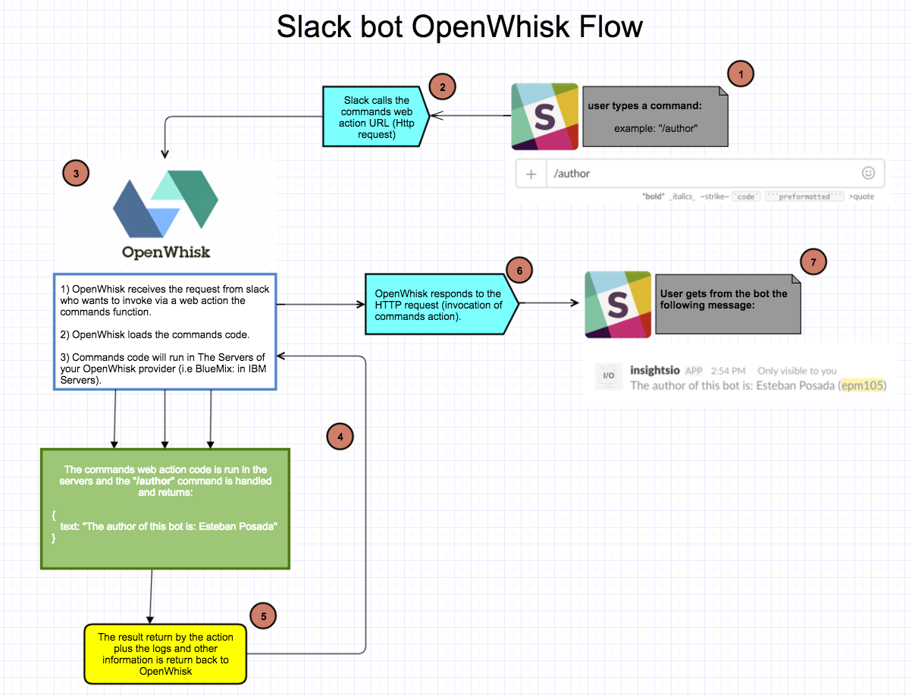

## The Flow Diagram of the Slack Bot Application using OpenWhisk

---
## Library explanation and documentation

The following files will do all the dirty work for you. Below is a brief
description of what each file does.

* **lib/authenticationLib.js:** deals with all the authentication required to be able to install/distribute the **Insights I/O Bot!**.

* **lib/commandsLib.js:** contains all the functions to deal with responding to the commands you will support add or the bot currently support.

* **lib/eventsLib.js:** contains all the functions to deal with responding to the events you will add or the bot currently support.

* **lib/setupendpoint.js:** code that will be use to set up the end points (urls) that will be called by slack in the case a command, event or authentication occurred. (No need to worry about the code inside this file)

* **lib/respondWebPages.js:** code that handles with the success and failure web pages when distributing the app.

* **Configure.java:** the CLI program that will allow you to set up all the files and request URL for you. (No need to worry about the code in this file)

* **distribution/index.html:** the webpage to share to other teams to install our bot!

* **Makefile:** making you the life easier, just need to run `make run` and then we can interact with the Configure program.

* **documentation/:** this folder contains webpage with the documentation for each supporting file we use in this project.

* **Gruntfiles:** allow us to easily merge js files (no need to worry about this!)

* **package.json:** for `npm` dependencies and other (no need to worry) things.

---

## To see the functions' documentation for each library file visit these links:

  * [authenticationLib file](https://git.corp.adobe.com/pages/posada/slackbot-library/documentation/authenticationLib.html)
  
  * [eventsLib file](https://git.corp.adobe.com/pages/posada/slackbot-library/documentation/eventsLib.html)
  
  * [commandsLib file](https://git.corp.adobe.com/pages/posada/slackbot-library/documentation/commandsLib.html)
  
  * [verificationLib file](https://git.corp.adobe.com/pages/posada/slackbot-library/documentation/commandsLib.html)
  
---
## Need help? There is a bug? Want to Contribute? Something out of date?

Thanks for taking the time to read through this tutorial! We hope this was useful, we are always trying to make your life as a developer easier. If you find a bug or want to ask us something please send us an email to:

**posada@adobe.com**

If you want to contribute, please send us a **Pull Request** and we will reach to you as soon as we can!

